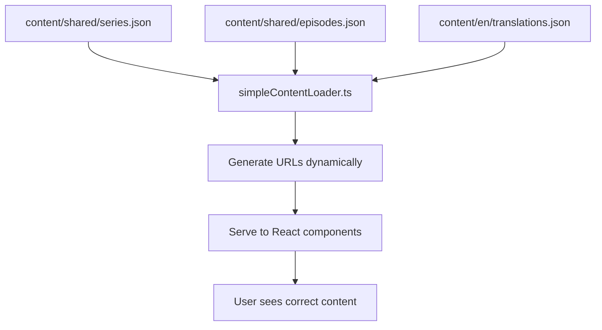

# Simple CMS Primer - Understanding Our Content Management Approach

**Date:** 2025-06-20  
**For:** Content creators, developers, and project stakeholders  
**Complexity Level:** Beginner-friendly with technical details  

---

## What Is This About?

The UrantiaBookPod website currently has **content management problems** that are causing bugs and making it hard to add new languages. This document explains our **simple solution** that fixes these issues while keeping everything easy to manage.

---

## 🚨 The Current Problem (In Simple Terms)

### What's Broken Right Now

**Problem 1: Hardcoded URLs Everywhere**
```json
// BAD: Current episodes.json has this
{
  "id": 1,
  "title": "The Universal Father",
  "audioUrl": "/pdfs/cosmic-1/1.pdf",  // ❌ This is hardcoded and wrong!
  "pdfUrl": "/pdfs/cosmic-1/1.pdf"     // ❌ This points to local files that don't exist!
}
```

When someone clicks "Download PDF" on the Spanish version, it tries to download `/pdfs/cosmic-1/1.pdf` but that file doesn't exist. It should be downloading `https://pub-123.r2.dev/paper-1-es.pdf` from our Cloudflare storage.

**Problem 2: Scattered Content Files**
- Episode data is in `src/data/json/episodes.json`
- English translations are in `src/locales/en/common.json`, `src/locales/en/home.json`, etc.
- Spanish translations are in `src/locales/es/common.json`, `src/locales/es/home.json`, etc.
- URL generation logic is scattered across multiple files

**Problem 3: No Validation**
When someone edits the JSON files, there's no way to check if they made a mistake until the website breaks.

---

## 🎯 Our Simple Solution

### The Big Idea: "Clean Content + Smart URL Generation"

Instead of storing broken URLs in our content files, we'll store **only the essential information** and let the code **generate the correct URLs automatically**.

### Detailed Content Transformation Analysis

## Current Content Files (BEFORE)

| File | Purpose | Problems | Size | Structure Issues |
|------|---------|----------|------|------------------|
| `src/data/json/episodes.json` | All content data | Hardcoded URLs, mixed concerns | 2,974 lines | Series + episodes + URLs mixed together |
| `src/locales/en/common.json` | English navigation/UI | Scattered translations | 59 lines | Deep nesting, multiple namespaces |
| `src/locales/en/home.json` | English home page | Scattered translations | 58 lines | Separate file per page |
| `src/locales/en/episode.json` | English episode UI | Scattered translations | 53 lines | Separate file per component |
| `src/locales/en/contact.json` | English contact form | Scattered translations | 84 lines | Separate file per feature |
| `src/locales/es/common.json` | Spanish navigation/UI | Scattered translations | 59 lines | Mirror structure of EN |
| `src/locales/es/home.json` | Spanish home page | Scattered translations | 58 lines | Must be kept in sync with EN |
| **TOTAL** | **Mixed content** | **Multiple issues** | **~3,500+ lines** | **11+ files to maintain** |

## New Content Structure (AFTER)

| File | Purpose | Benefits | Estimated Size | Structure Advantages |
|------|---------|----------|----------------|---------------------|
| `content/shared/series.json` | Series metadata only | No URLs, validated | ~200 lines | Clean, single purpose |
| `content/shared/episodes.json` | Episode metadata only | No URLs, validated | ~800 lines | Structured, validated |
| `content/en/translations.json` | All English UI text | Consolidated | ~400 lines | Single source of truth |
| `content/es/translations.json` | All Spanish UI text | Consolidated | ~400 lines | Easy to compare with EN |
| **TOTAL** | **Clean separation** | **Validated, organized** | **~1,800 lines** | **4 files total** |

## Detailed Transformation Rules

### 1. Series Data Transformation

**BEFORE (`src/data/json/episodes.json`):**
```json
{
  "cosmic-1": {
    "seriesTitle": "Cosmic Origins: Understanding Universe Creation",
    "seriesDescription": "Introducing the fundamental cosmology...",
    "episodes": [...]
  },
  "jesus-1": {
    "seriesTitle": "The Divine and Human Jesus", 
    "seriesDescription": "Explore the profound dual nature...",
    "episodes": [...]
  }
}
```

**AFTER (`content/shared/series.json`):**
```json
{
  "cosmic-1": {
    "id": "cosmic-1",
    "title": "Cosmic Origins: Understanding Universe Creation",
    "description": "Introducing the fundamental cosmology...",
    "category": "parts-i-iii", 
    "totalEpisodes": 5,
    "sortOrder": 1,
    "isActive": true
  },
  "jesus-1": {
    "id": "jesus-1", 
    "title": "The Divine and Human Jesus",
    "description": "Explore the profound dual nature...",
    "category": "jesus-focused",
    "totalEpisodes": 5,
    "sortOrder": 10,
    "isActive": true
  }
}
```

### 2. Episode Data Transformation

**BEFORE (Mixed with hardcoded URLs):**
```json
{
  "cosmic-1": {
    "episodes": [
      {
        "id": 1,
        "title": "The Universal Father",
        "audioUrl": "cosmic-1-1.mp3",           // ❌ Hardcoded pattern
        "pdfUrl": "/pdfs/cosmic-1/1.pdf",      // ❌ Wrong local path
        "summaryKey": "paper_1",
        "imageUrl": "/images/cosmic-1/card-1.jpg" // ❌ Hardcoded local path
      }
    ]
  }
}
```

**AFTER (Clean metadata only):**
```json
{
  "cosmic-1": [
    {
      "id": 1,
      "seriesId": "cosmic-1",
      "title": "The Universal Father", 
      "summaryKey": "paper_1",
      "sortOrder": 1,
      "isActive": true
      // NO audioUrl, pdfUrl, imageUrl - generated dynamically!
    }
  ]
}
```

### 3. URL Generation Transformation

**BEFORE (Hardcoded and wrong):**
- `audioUrl: "cosmic-1-1.mp3"` → Broken, no base URL
- `pdfUrl: "/pdfs/cosmic-1/1.pdf"` → Points to non-existent local file
- Spanish users get same wrong URLs

**AFTER (Dynamic generation):**
```typescript
// For cosmic-1, episode 1:
// English:
audioUrl: "https://pub-[R2_ID].r2.dev/paper-1.mp3"
pdfUrl: "https://pub-[R2_ID].r2.dev/paper-1.pdf"

// Spanish:  
audioUrl: "https://pub-[R2_ID].r2.dev/paper-1-es.mp3"
pdfUrl: "https://pub-[R2_ID].r2.dev/paper-1-es.pdf"
```

### 4. Translation Files Transformation

**BEFORE (Scattered across 10+ files per language):**
```
src/locales/en/
├── common.json      → nav, footer, site, actions (59 lines)
├── home.json        → hero, features, testimonials (58 lines) 
├── episode.json     → player, download, metadata (53 lines)
├── contact.json     → form, validation, success (84 lines)
├── series.json      → navigation, descriptions (19 lines)
└── ... 6 more files
```

**AFTER (Consolidated into single file per language):**
```json
// content/en/translations.json (all English text)
{
  "common.nav.home": "Home",
  "common.nav.episodes": "Episodes", 
  "common.footer.copyright": "© {{year}} The Center for Unity...",
  "home.hero.title": "AI-Crafted Audio Companions...",
  "episode.player.play": "Play",
  "episode.download.pdf": "Download PDF",
  "contact.form.name": "Name",
  "series.cosmic.title": "Cosmic Series"
  // ... all translations in one place
}
```

## Specific Series Type Transformations

### Jesus Series (No PDFs)
**BEFORE:**
```json
{
  "id": 1,
  "title": "The Personality of God",
  "audioUrl": null,                    // ❌ Inconsistent nulls
  "pdfUrl": null,                      // ❌ Inconsistent nulls  
  "summaryKey": "topic/personality-of-god",
  "imageUrl": "/images/jesus-1/card-1.jpg"  // ❌ Hardcoded
}
```

**AFTER:**
```json
{
  "id": 1,
  "seriesId": "jesus-1",
  "title": "The Personality of God",
  "summaryKey": "topic/personality-of-god",
  "sortOrder": 1,
  "isActive": true
  // URLs generated: audio only, no PDF
}
```

### Cosmic Series (With PDFs) 
**BEFORE:**
```json
{
  "id": 1,
  "title": "The Universal Father",
  "audioUrl": "cosmic-1-1.mp3",          // ❌ Wrong pattern
  "pdfUrl": "/pdfs/cosmic-1/1.pdf",      // ❌ Wrong path
  "summaryKey": "paper_1"
}
```

**AFTER:**
```json
{
  "id": 1, 
  "seriesId": "cosmic-1",
  "title": "The Universal Father",
  "summaryKey": "paper_1",
  "sortOrder": 1,
  "isActive": true
  // URLs generated: paper-1.mp3, paper-1.pdf
}
```

### Platform Series (Different URL Pattern)
**BEFORE:**
```json
{
  "id": 1,
  "title": "Paper 120: The Bestowal of Michael on Urantia",
  "audioUrl": "paper-120.mp3",           // ❌ Different pattern, confusing
  "pdfUrl": "paper-120.pdf",             // ❌ Different pattern
  "summaryKey": "paper_120"
}
```

**AFTER:**
```json
{
  "id": 1,
  "seriesId": "series-platform-4", 
  "title": "Paper 120: The Bestowal of Michael on Urantia",
  "summaryKey": "paper_120",
  "sortOrder": 1,
  "isActive": true
  // URLs generated: series-platform-4/1.mp3, series-platform-4/1.pdf
}
```

## Key Transformation Benefits

| Issue | Before | After | Impact |
|-------|--------|-------|---------|
| **Hardcoded URLs** | `"/pdfs/cosmic-1/1.pdf"` | Generated dynamically | ✅ No more broken links |
| **Language Support** | Same URLs for all languages | Language-specific generation | ✅ Spanish PDFs work |
| **Maintenance** | Edit URLs in 50+ places | Edit logic in 1 place | ✅ Single source of truth |
| **Validation** | No error checking | Zod schema validation | ✅ Catch errors early |
| **Translation Sync** | 10+ files per language | 1 file per language | ✅ Easy to compare/sync |
| **File Count** | 11+ files to maintain | 4 files total | ✅ Simpler structure |
| **Adding Languages** | Copy 10+ files | Copy 1 file | ✅ Scalable i18n |
| **Adding Series** | Edit massive JSON | Add clean metadata | ✅ Developer-friendly |

## Error Scenarios Eliminated

### Current Problems Fixed:
1. **Spanish PDF links broken** → Dynamic generation fixes language parameter passing
2. **Hardcoded local paths** → R2 URLs generated from base URL + patterns  
3. **Inconsistent null values** → Clean schema with proper optionals
4. **Translation drift** → Single file makes comparison easy
5. **Manual URL updates** → Automatic generation prevents human error
6. **Schema violations** → Zod validation catches issues before deploy
7. **Complex maintenance** → Logical file structure reduces cognitive load

This transformation reduces the content from **3,500+ lines across 11+ files** to **1,800 lines across 4 clean files**, while fixing all URL generation issues and enabling proper multi-language support.

---

## 🏗️ The New Architecture (Technical Overview)

### Directory Structure
```
ubpod-new/
├── content/                     # 🆕 NEW: Clean content files
│   ├── shared/
│   │   ├── series.json         # Series info (language-neutral)
│   │   └── episodes.json       # Episode info (language-neutral)
│   ├── en/
│   │   └── translations.json   # All English text
│   └── es/
│       └── translations.json   # All Spanish text
├── src/
│   ├── schemas/
│   │   └── content.ts          # 🆕 NEW: Validation rules
│   └── utils/
│       └── simpleContentLoader.ts  # 🆕 NEW: Smart content loader
└── scripts/
    ├── migrate-to-simple-cms.ts    # 🆕 NEW: Migration script
    └── validate-simple-cms.ts      # 🆕 NEW: Validation script
```

### How Content Flows Through the System



### The Three Types of Content

**1. Series Metadata (Language-Neutral)**
```json
// content/shared/series.json
{
  "cosmic-1": {
    "id": "cosmic-1",
    "title": "The Central Universe",
    "description": "Exploring cosmic reality",
    "category": "parts-i-iii",
    "totalEpisodes": 196,
    "sortOrder": 1,
    "isActive": true
  }
}
```

**2. Episode Metadata (Language-Neutral)**
```json
// content/shared/episodes.json
{
  "cosmic-1": [
    {
      "id": 1,
      "seriesId": "cosmic-1", 
      "title": "The Universal Father",
      "summaryKey": "universal-father",
      "sortOrder": 1,
      "isActive": true
    }
  ]
}
```

**3. UI Translations (Language-Specific)**
```json
// content/en/translations.json
{
  "common.navigation.home": "Home",
  "common.navigation.series": "Series",
  "episode.download.pdf": "Download PDF",
  "episode.play.audio": "Play Audio"
}

// content/es/translations.json
{
  "common.navigation.home": "Inicio", 
  "common.navigation.series": "Series",
  "episode.download.pdf": "Descargar PDF",
  "episode.play.audio": "Reproducir Audio"
}
```

---

## 🔧 How URL Generation Works (The Smart Part)

### The URL Generation Engine

Our new `simpleContentLoader.ts` takes the clean metadata and generates the correct URLs:

```typescript
// Input: Clean metadata
const episode = {
  id: 1,
  seriesId: "cosmic-1",
  title: "The Universal Father"
}

// Output: Complete episode with generated URLs
const enrichedEpisode = {
  id: 1,
  title: "The Universal Father", 
  series: "cosmic-1",
  audioUrl: "https://pub-123.r2.dev/paper-1.mp3",      // ✅ Generated!
  pdfUrl: "https://pub-123.r2.dev/paper-1.pdf",        // ✅ Generated!
  transcriptUrl: "https://pub-123.r2.dev/paper-1.txt"  // ✅ Generated!
}

// For Spanish:
const spanishEpisode = {
  // ... same metadata ...
  audioUrl: "https://pub-123.r2.dev/paper-1-es.mp3",   // ✅ Spanish audio!
  pdfUrl: "https://pub-123.r2.dev/paper-1-es.pdf",     // ✅ Spanish PDF!
  transcriptUrl: "https://pub-123.r2.dev/paper-1-es.txt"
}
```

### URL Generation Rules

**Cosmic Series (Urantia Papers):**
- English Audio: `paper-{episodeId}.mp3`
- Spanish Audio: `paper-{episodeId}-es.mp3`  
- English PDF: `paper-{episodeId}.pdf`
- Spanish PDF: `paper-{episodeId}-es.pdf`

**Jesus Series:**
- Audio: `{seriesId}/{episodeId}.mp3`
- No PDFs available

**Platform/History Series:**
- Audio: `{seriesId}/{episodeId}.mp3` 
- No PDFs available

---

## 🔍 Content Validation (Error Prevention)

### What Is Zod Validation?

[Zod](https://zod.dev) is a TypeScript library that checks if our content files have the right structure. Think of it as a **spell-checker for JSON files**.

### Example Validation Rules

```typescript
// This ensures every series has the required fields
const SeriesSchema = z.object({
  id: z.string(),                    // Must be a string
  title: z.string(),                 // Must be a string  
  description: z.string(),           // Must be a string
  category: z.enum(['jesus-focused', 'parts-i-iii', 'platform', 'history']), // Must be one of these
  totalEpisodes: z.number().optional(), // Must be a number (optional)
  sortOrder: z.number().default(0),     // Must be a number, defaults to 0
  isActive: z.boolean().default(true)   // Must be true/false, defaults to true
});
```

### What Happens When Validation Fails

**Before (No Validation):**
- Someone accidentally deletes a comma in the JSON
- Website breaks in production  
- Users can't access content
- We don't know until users complain

**After (With Validation):**
- Someone accidentally deletes a comma
- Validation script runs: `npm run validate:content`
- Error shows immediately: "Invalid JSON on line 15"
- Developer fixes it before deploying
- Website never breaks

---

## 👨‍💻 Developer Workflow

### Daily Development Process

**1. Start Development**
```bash
npm run dev
# This automatically:
# - Validates all content files
# - Starts the development server
# - Shows any content errors immediately
```

**2. Make Content Changes**
```bash
# Edit content files
vim content/shared/series.json

# Validate changes
npm run validate:content

# If validation passes:
✅ Series validation passed
✅ Episodes validation passed  
✅ EN translations: 127 keys
✅ ES translations: 127 keys
🎉 All validations passed!
```

**3. Deploy to Production**
```bash
npm run build
# This automatically:
# - Validates content
# - Builds the application
# - Fails if content is invalid
```

### Content Editing Rules

**DO:**
- ✅ Edit JSON files in the `content/` directory
- ✅ Run `npm run validate:content` after changes
- ✅ Test both English and Spanish versions
- ✅ Never add `audioUrl` or `pdfUrl` fields (they're generated automatically)

**DON'T:**
- ❌ Never hardcode media URLs
- ❌ Don't edit files in `src/data/json/` (these will be removed)
- ❌ Don't skip validation before committing

---

## 🌍 Adding New Languages (Future)

### Current: EN + ES Support

Right now we support English and Spanish. Here's how content is structured:

```
content/
├── shared/           # Language-neutral metadata
├── en/              # English UI text
└── es/              # Spanish UI text
```

### Future: Adding French

When we want to add French, we simply:

**1. Add French Translations Directory**
```bash
mkdir content/fr
```

**2. Create French Translation File**
```json
// content/fr/translations.json
{
  "common.navigation.home": "Accueil",
  "common.navigation.series": "Séries", 
  "episode.download.pdf": "Télécharger PDF",
  "episode.play.audio": "Lire Audio"
}
```

**3. Update URL Generation (If Needed)**
```typescript
// If French audio files exist, update the URL generator:
if (language === 'fr') {
  return `${R2_BASE_URL}/paper-${episodeId}-fr.mp3`;
}
```

**4. Update Validation Schema**
```typescript
// Add 'fr' to supported languages
language: z.enum(['en', 'es', 'fr'])
```

**That's it!** No complex migrations, no database changes, no server restarts.

### Scaling to Many Languages

```
content/
├── shared/          # Always language-neutral
├── en/             # English
├── es/             # Spanish  
├── fr/             # French
├── de/             # German
├── pt/             # Portuguese
└── it/             # Italian
```

Each language just needs its own translations file. The series and episode metadata stays the same for all languages.

---

## 📚 Adding New Series (Future)

### Example: Adding a New "Thought Adjuster" Series

**1. Add Series Metadata**
```json
// content/shared/series.json
{
  "existing-series": { /* ... */ },
  "adjuster-1": {
    "id": "adjuster-1", 
    "title": "The Mystery Monitors",
    "description": "Understanding Thought Adjusters",
    "category": "parts-i-iii",
    "totalEpisodes": 7,
    "sortOrder": 4,
    "isActive": true
  }
}
```

**2. Add Episode Metadata**
```json
// content/shared/episodes.json  
{
  "existing-series": [ /* ... */ ],
  "adjuster-1": [
    {
      "id": 1,
      "seriesId": "adjuster-1",
      "title": "The Origin and Nature of Thought Adjusters", 
      "summaryKey": "adjuster-origin",
      "sortOrder": 1,
      "isActive": true
    },
    {
      "id": 2, 
      "seriesId": "adjuster-1",
      "title": "The Indwelling of Thought Adjusters",
      "summaryKey": "adjuster-indwelling", 
      "sortOrder": 2,
      "isActive": true
    }
    // ... more episodes
  ]
}
```

**3. Upload Media Files**
Upload audio files to Cloudflare R2:
- `adjuster-1/1.mp3`
- `adjuster-1/2.mp3`
- `adjuster-1/1-es.mp3` (if Spanish version exists)
- `adjuster-1/2-es.mp3`

**4. Update URL Generation (If Needed)**
```typescript
// If this series follows a different pattern:
if (seriesId.startsWith('adjuster-')) {
  return `${R2_BASE_URL}/${seriesId}/${episodeId}.mp3`;
}
```

**5. Validate and Deploy**
```bash
npm run validate:content  # Check for errors
npm run build            # Build and deploy
```

**The URLs are automatically generated:**
- Episode 1 Audio: `https://pub-123.r2.dev/adjuster-1/1.mp3`
- Episode 2 Audio: `https://pub-123.r2.dev/adjuster-1/2.mp3`
- Spanish Episode 1: `https://pub-123.r2.dev/adjuster-1/1-es.mp3`

---

## 🔄 Migration Process (One-Time Setup)

### What Happens During Migration

**Step 1: Create New Structure**
```bash
# Creates the new content directories
mkdir -p content/{shared,en,es}
```

**Step 2: Extract Clean Data**
```bash
# Runs migration script
npx tsx scripts/migrate-to-simple-cms.ts

# This converts:
# src/data/json/episodes.json (messy, with hardcoded URLs)
# → content/shared/series.json (clean metadata only)
# → content/shared/episodes.json (clean metadata only)
```

**Step 3: Consolidate Translations**
```bash
# Runs translation migration  
npx tsx scripts/migrate-translations.ts

# This converts:
# src/locales/en/common.json, src/locales/en/home.json, etc.
# → content/en/translations.json (all English text)
# 
# src/locales/es/common.json, src/locales/es/home.json, etc.  
# → content/es/translations.json (all Spanish text)
```

**Step 4: Update Code**
- Replace old content loading with new `simpleContentLoader`
- Update all URL generation to use the new functions
- Remove references to old JSON files

**Step 5: Validation**
```bash
# Test everything works
npm run validate:content
npm run build
npm run dev
```

---

## 🎯 Benefits of This Approach

### For Developers

**Before:**
- ❌ Bugs from hardcoded URLs
- ❌ Complex file structure
- ❌ No content validation
- ❌ Hard to add new languages
- ❌ URL generation scattered everywhere

**After:**
- ✅ No hardcoded URLs possible
- ✅ Clean, logical file structure  
- ✅ Automatic content validation
- ✅ Easy to add new languages
- ✅ Centralized URL generation

### For Content Editors

**Before:**
- ❌ Edit multiple files for one change
- ❌ Risk breaking the website with typos
- ❌ No way to know if content is valid
- ❌ Complex file paths to remember

**After:**
- ✅ Edit one logical file per change type
- ✅ Validation catches errors immediately  
- ✅ Clear error messages when something's wrong
- ✅ Simple, predictable file structure

### For Users

**Before:**
- ❌ Broken PDF download links
- ❌ Inconsistent language switching
- ❌ Missing content in Spanish

**After:**
- ✅ PDF downloads always work
- ✅ Smooth language switching
- ✅ Consistent content across languages

---

## 🚀 Future Roadmap

### Phase 1: Simple CMS (Current Plan)
- ✅ Fix hardcoded URL bugs
- ✅ Clean content structure
- ✅ Content validation
- ✅ Stable EN/ES deployment

### Phase 2: Enhanced Content Management
- 🔄 Rich text episode descriptions
- 🔄 Content preview system
- 🔄 Automated translation workflows
- 🔄 Content contributor documentation

### Phase 3: Full CMS (Future)
- 🔄 Web-based content editing interface ([Decap CMS](https://decapcms.org/))
- 🔄 Real-time content collaboration
- 🔄 Advanced content workflows
- 🔄 Content scheduling and publishing

### Phase 4: Advanced Features
- 🔄 Search functionality
- 🔄 Content recommendations
- 🔄 User playlists and bookmarks
- 🔄 Analytics and content insights

---

## 🤔 Frequently Asked Questions

### Q: Will this break existing URLs?
**A:** No! All existing URLs like `/episode/cosmic-1/1` will continue to work exactly the same. We're only changing how the content is organized internally.

### Q: What if I make a mistake editing the JSON files?
**A:** The validation system will catch it immediately when you run `npm run validate:content`. It will show you exactly what's wrong and which line to fix.

### Q: How do I add a new episode to an existing series?
**A:** Just add a new entry to the episodes array in `content/shared/episodes.json`:
```json
{
  "id": 197,
  "seriesId": "cosmic-1", 
  "title": "New Episode Title",
  "sortOrder": 197,
  "isActive": true
}
```
Then upload the audio file to R2 as `paper-197.mp3`.

### Q: What happens if Cloudflare R2 is down?
**A:** The website will still work, but audio/PDF downloads won't. This is the same as before - our content files don't depend on R2 being available for the site to load.

### Q: Can I still edit content while the website is running?
**A:** Yes, but you need to rebuild and redeploy for changes to appear. This is a **static site** - changes aren't live until you deploy them.

### Q: What if I want to temporarily hide a series or episode?
**A:** Set `"isActive": false` in the content file. It will be hidden from the website but not deleted.

### Q: How do I know what audio files are available on R2?
**A:** You can check the R2 bucket directly, or use our existing R2 sync scripts in the `synch-r2/` directory.

---

## 📖 Quick Reference

### Important Files

| File | Purpose | Edit Frequency |
|------|---------|----------------|
| `content/shared/series.json` | Series metadata | Rarely (when adding new series) |
| `content/shared/episodes.json` | Episode metadata | Sometimes (when adding episodes) |
| `content/en/translations.json` | English UI text | Sometimes (when updating text) |
| `content/es/translations.json` | Spanish UI text | Sometimes (when updating text) |
| `src/schemas/content.ts` | Validation rules | Rarely (when changing structure) |

### Important Commands

| Command | Purpose | When to Use |
|---------|---------|-------------|
| `npm run validate:content` | Check for content errors | After editing content files |
| `npm run dev` | Start development server | During development |
| `npm run build` | Build for production | Before deploying |
| `npm run migrate:simple-cms` | Run migration (one-time) | During initial setup |

### URL Patterns

| Content Type | English URL | Spanish URL |
|--------------|-------------|-------------|
| Cosmic series audio | `paper-{id}.mp3` | `paper-{id}-es.mp3` |
| Cosmic series PDF | `paper-{id}.pdf` | `paper-{id}-es.pdf` |
| Jesus series audio | `{seriesId}/{id}.mp3` | `{seriesId}/{id}-es.mp3` |
| Platform series audio | `{seriesId}/{id}.mp3` | `{seriesId}/{id}-es.mp3` |

---

## 🎉 Conclusion

This Simple CMS approach gives us the **best of both worlds**:

1. **Immediate bug fixes** for the hardcoded URL problems
2. **Clean foundation** for future growth and features
3. **Developer-friendly** workflow with validation and error prevention
4. **Content-editor-friendly** structure that's logical and safe
5. **User-friendly** experience with working downloads and language switching

The beauty is in its simplicity - we're not over-engineering a solution, but we're also not accepting a broken status quo. This approach **solves today's problems** while **enabling tomorrow's possibilities**.

Ready to get started? Let's implement Phase 1! 🚀 