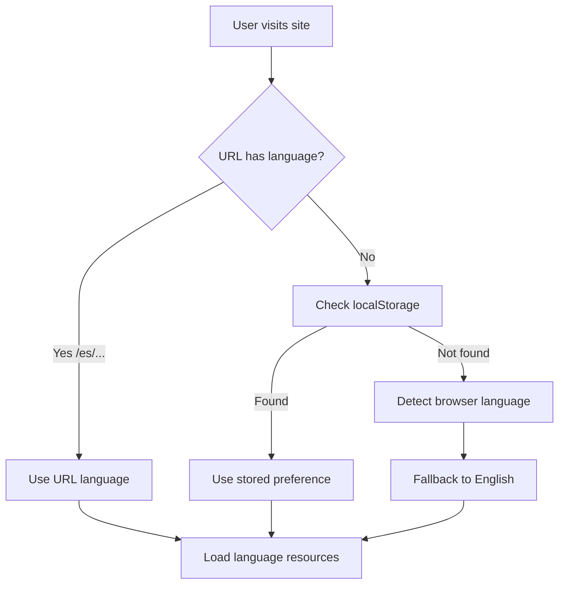

# UBPod i18n Implementation: Summary and Lessons Learned
**Date:** July 14, 2025  
**Project:** UBPod Internationalization  
**Languages Implemented:** English, Spanish, French, Portuguese

## Executive Summary

This document captures the complete internationalization (i18n) implementation of the UBPod project, detailing the architecture, design decisions, implementation patterns, and critical lessons learned. The system successfully supports multiple languages with a scalable architecture that separates UI translations from content translations, enabling efficient management of over 200 episodes across multiple series in four languages.

## Table of Contents
1. [Conceptual Overview](#conceptual-overview)
2. [Architecture Design](#architecture-design)
3. [Implementation Details](#implementation-details)
4. [Key Design Decisions](#key-design-decisions)
5. [Lessons Learned](#lessons-learned)
6. [Best Practices](#best-practices)
7. [Pitfalls to Avoid](#pitfalls-to-avoid)
8. [Future Recommendations](#future-recommendations)

## Conceptual Overview

### What is i18n?
Internationalization (i18n) is the process of designing software to support multiple languages and regions without engineering changes. In UBPod, this means:
- UI elements adapt to user's language preference
- Content (episode titles, descriptions) displays in selected language
- URLs reflect language choice (`/en/`, `/es/`, `/fr/`, `/pt/`)
- Audio/PDF files load language-specific versions

### Why This Approach?
1. **Scalability**: Easy to add new languages
2. **Maintainability**: Centralized translation management
3. **Performance**: Lazy loading of language resources
4. **SEO**: Language-specific URLs for better search indexing
5. **User Experience**: Persistent language preferences

## Architecture Design

### Core Technologies
```typescript
// Technology Stack
{
  "framework": "React 18 with TypeScript",
  "i18n-library": "react-i18next",
  "routing": "react-router-dom v6",
  "translation": "DeepL API",
  "storage": "Cloudflare R2",
  "build": "Vite"
}
```

### File Structure
```
src/
├── i18n/
│   ├── i18n.ts              # Core i18n configuration
│   └── LanguageContext.tsx   # React context for language state
├── locales/
│   ├── series-metadata.json  # Shared, language-agnostic metadata
│   ├── en/                   # English translations
│   │   ├── common.json       # UI: Navigation, footer, shared
│   │   ├── episode.json      # UI: Episode player interface
│   │   ├── home.json         # UI: Homepage
│   │   ├── series.json       # UI: Series listings
│   │   └── content/
│   │       └── content.json  # Content: All episode data
│   ├── es/                   # Spanish (same structure)
│   ├── fr/                   # French (same structure)
│   └── pt/                   # Portuguese (same structure)
```

### Language Detection Flow


## Implementation Details

### 1. i18n Configuration (`i18n.ts`)
```typescript
import i18n from 'i18next';
import { initReactI18next } from 'react-i18next';
import LanguageDetector from 'i18next-browser-languagedetector';

// Import all translation files
import enCommon from '../locales/en/common.json';
import esCommon from '../locales/es/common.json';
// ... more imports

i18n
  .use(LanguageDetector)
  .use(initReactI18next)
  .init({
    fallbackLng: 'en',
    supportedLngs: ['en', 'es', 'fr', 'pt'],
    detection: {
      order: ['path', 'navigator'],
      lookupFromPathIndex: 0,
    },
    resources: {
      en: { common: enCommon, /* ... */ },
      es: { common: esCommon, /* ... */ },
      // ... more languages
    }
  });
```

**Key Points:**
- Direct JSON imports (no async loading needed)
- URL-based detection takes precedence
- Automatic fallback chain: URL → Browser → English

### 2. Localized Routing Pattern
```typescript
// LocalizedLink component ensures consistent language prefixes
export const LocalizedLink: React.FC<LocalizedLinkProps> = ({ 
  to, 
  children, 
  ...props 
}) => {
  const { language } = useLanguage();
  const localizedPath = `/${language}${to}`;
  return <Link to={localizedPath} {...props}>{children}</Link>;
};

// Route configuration in App.tsx
<Routes>
  <Route path="/" element={<RootRedirect />} />
  <Route path="/:lang" element={<LanguageLayout />}>
    <Route index element={<Home />} />
    <Route path="series/:seriesId" element={<SeriesPage />} />
    <Route path="episode/:seriesId/:episodeId" element={<EpisodePage />} />
    // ... more routes
  </Route>
</Routes>
```

**Critical Learning**: Always use `LocalizedLink` instead of React Router's `Link` to maintain language context.

### 3. Content Structure Evolution

#### Initial Approach (Fragmented)
```
content/
├── urantia-papers.json
├── episode-titles.json
├── episode-loglines.json
├── general-summaries.json
└── series-metadata.json
```

#### Final Approach (Consolidated)
```
content/
└── content.json  # All series and episodes in one file
```

**Why Consolidation?**
- Simpler translation workflow
- Easier content management
- Single source of truth
- Reduced file I/O

### 4. Translation Integration
```typescript
// UI Translation
const { t } = useTranslation('common');
<h1>{t('nav.home')}</h1>

// Content Access
import frContent from '../locales/fr/content/content.json';
const episode = frContent['urantia-papers'].episodes['77'];
```

### 5. Media URL Generation
```typescript
// Language-aware media URLs
export function getAudioUrl(
  seriesId: string, 
  episodeId: number, 
  language: string
): string {
  const baseName = `paper-${episodeId}`;
  const suffix = language !== 'en' ? `-${language}` : '';
  return `${CDN_URL}/${baseName}${suffix}.mp3`;
}
// Result: paper-77-fr.mp3, paper-77-es.mp3, paper-77.mp3 (en)
```

## Key Design Decisions

### 1. Consolidated Content Structure
**Decision**: Merge all episode content into single `content.json` per language  
**Rationale**: 
- Simplified translation process
- Better performance (single file load)
- Easier content updates

### 2. URL-Based Language Detection
**Decision**: Use URL path prefix (`/fr/`, `/es/`) as primary language indicator  
**Rationale**:
- SEO friendly
- Shareable URLs maintain language
- Clear user intent

### 3. Separate UI from Content
**Decision**: UI strings in namespace files, episode content in content.json  
**Rationale**:
- Different translation workflows
- UI changes less frequently
- Content updates independently

### 4. Translation Automation
**Decision**: Build DeepL-powered translation scripts  
**Rationale**:
- Consistent quality baseline
- Rapid language deployment
- Cost-effective for large content volume

## Lessons Learned

### 1. Content Structure is Critical
**Problem**: Initial fragmented JSON structure made translations complex  
**Solution**: Consolidated into single content.json  
**Learning**: Design content structure for translation workflow, not just code organization

### 2. Array vs Object in JSON
**Problem**: DeepL sometimes returned objects `{"0": "...", "1": "..."}` instead of arrays  
**Solution**: Post-processing script to fix structure  
**Learning**: Always validate translated JSON structure, not just content

### 3. Terminology Consistency
**Problem**: "Paper" translated differently across files ("papier", "document", "article")  
**Solution**: Terminology fix script + glossary for translators  
**Learning**: Establish terminology standards before translation

### 4. Routing Complexity
**Problem**: Mixed use of `Link` and `LocalizedLink` caused language switching issues  
**Solution**: Comprehensive audit and standardization  
**Learning**: Enforce routing patterns early and consistently

### 5. Media File Naming
**Problem**: Inconsistent naming patterns across languages (French: "Paper 160 Fr Int.wav")  
**Solution**: Standardized upload scripts with renaming logic  
**Learning**: Define naming conventions before content creation

### 6. Translation API Quirks
**Problem**: DeepL requires 'PT-BR' not 'PT' for Portuguese  
**Solution**: Language code mapping in translation scripts  
**Learning**: Test API requirements for each target language

## Best Practices

### 1. Component Development
```typescript
// Always use typed props
interface Props {
  titleKey: string;
  namespace?: string;
}

// Always use translation hook
const { t } = useTranslation(namespace);

// Always use LocalizedLink
<LocalizedLink to="/series">
```

### 2. Script Development
```bash
# Always include:
- Dry run mode
- Resume capability  
- Verification mode
- Comprehensive logging
- Backup creation
```

### 3. Translation Workflow
1. **Backup** existing translations
2. **Translate** with context hints
3. **Validate** JSON structure
4. **Review** terminology consistency
5. **Test** in application

### 4. Content Management
- Single source of truth (content.json)
- Language-agnostic metadata separate
- Consistent key naming across languages
- Version control all translations

## Pitfalls to Avoid

### 1. Don't Mix Routing Patterns
```typescript
// ❌ Bad
<Link to="/series">

// ✅ Good  
<LocalizedLink to="/series">
```

### 2. Don't Hardcode Language Strings
```typescript
// ❌ Bad
<h1>Welcome to UBPod</h1>

// ✅ Good
<h1>{t('home.welcome')}</h1>
```

### 3. Don't Assume Translation Structure
```typescript
// ❌ Bad
const items = t('items'); // Might be object or array

// ✅ Good
const items = t('items', { returnObjects: true }) as string[];
```

### 4. Don't Ignore Fallbacks
```typescript
// ❌ Bad
const content = frContent[seriesId].episodes[episodeId];

// ✅ Good
const content = frContent[seriesId]?.episodes[episodeId] || 
                enContent[seriesId]?.episodes[episodeId];
```

## Future Recommendations

### 1. Enhanced Translation Management
- Implement translation memory system
- Add glossary management UI
- Create review workflow for translations
- Add quality score tracking

### 2. Performance Optimizations
- Implement progressive translation loading
- Add language-specific caching strategies
- Consider CDN edge translation

### 3. Developer Experience
- Create i18n component library
- Add translation linting rules
- Build visual translation testing
- Automate terminology validation

### 4. Content Expansion
- Plan for RTL language support
- Design for locale-specific features
- Prepare for currency/date formatting
- Consider cultural adaptations

### 5. Monitoring and Analytics
- Track language usage patterns
- Monitor translation quality metrics
- Analyze performance by language
- Implement user feedback system

## Implementation Checklist for New Languages

When adding a new language, follow this checklist:

- [ ] Create locale directory structure (`src/locales/[lang]/`)
- [ ] Copy English JSON files as templates
- [ ] Update `i18n.ts` configuration
- [ ] Add to `supportedLngs` array
- [ ] Import all namespace files
- [ ] Configure resources
- [ ] Update `series-availability.json`
- [ ] Enable in `LanguageSwitcher.tsx`
- [ ] Create upload script from template
- [ ] Test Google Drive access
- [ ] Configure file naming patterns
- [ ] Run translation scripts
- [ ] Upload media files
- [ ] Test all routes
- [ ] Verify media playback
- [ ] Review translation quality
- [ ] Update documentation

## Conclusion

The UBPod i18n implementation demonstrates that successful internationalization requires careful planning of content structure, consistent implementation patterns, and robust tooling for translation management. The consolidated content approach, combined with automated translation workflows and standardized naming conventions, enables rapid language deployment while maintaining quality.

Key success factors:
1. **Unified content structure** simplifies management
2. **Automated translation** accelerates deployment  
3. **Consistent patterns** reduce errors
4. **Comprehensive tooling** ensures reliability
5. **Clear documentation** enables maintenance

This implementation serves as a foundation for continued global expansion while maintaining code quality and user experience across all supported languages.

---

**Document Version**: 1.0  
**Last Updated**: July 14, 2025  
**Authors**: Gabriel Rymberg, Claude Code Assistant  
**Status**: Active Reference Document